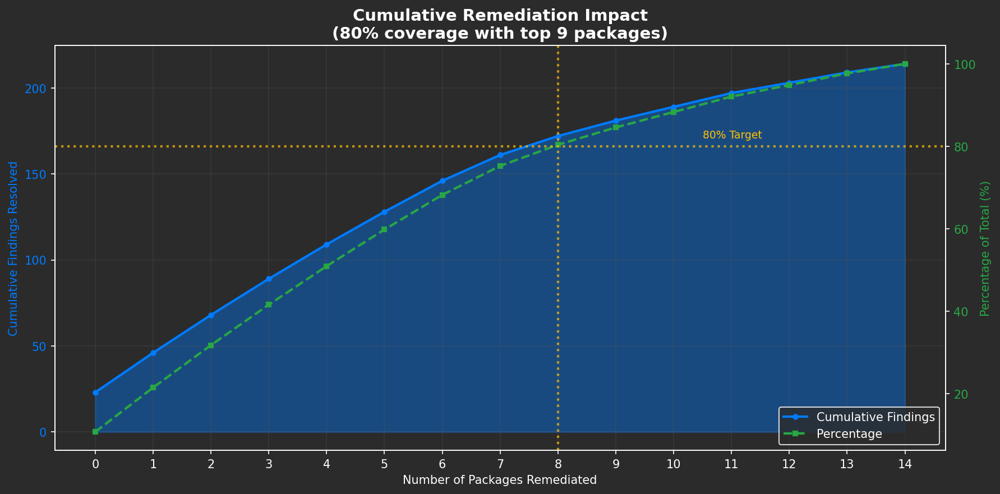
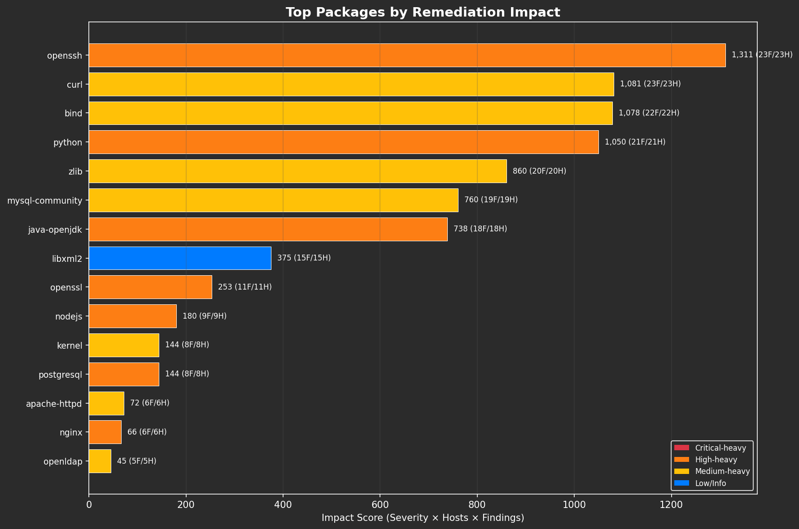
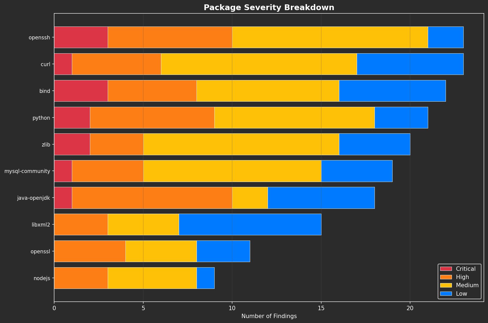
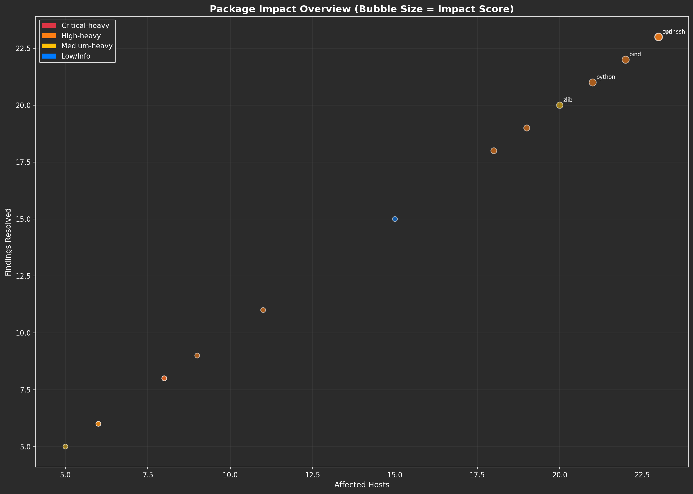
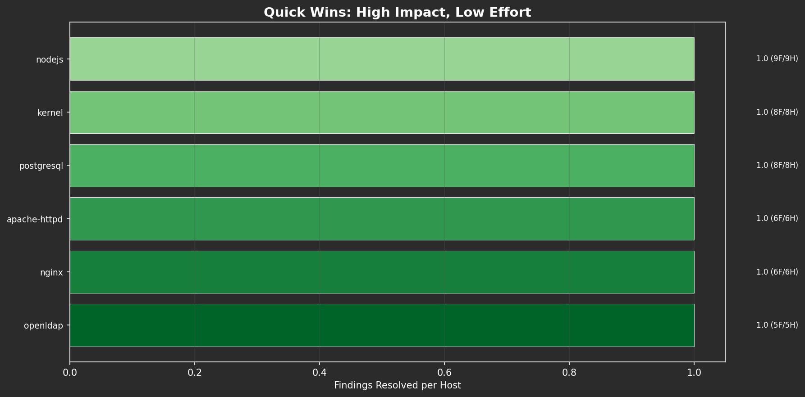

# Vulnerability Remediation Analytics: A Data Science Technical Reference

**For Data Scientists, Security Analysts, and Technical Stakeholders**

---

## Executive Summary

This document provides a comprehensive technical analysis of the vulnerability remediation prioritization system. It covers the mathematical models, algorithms, data structures, and visualization techniques used to transform raw vulnerability scan data into actionable remediation intelligence.

**Core Objective:** Identify optimal package upgrade sequences that maximize security improvement (findings resolved) while minimizing deployment effort (hosts affected).

---

## Table of Contents

1. [Problem Definition](#1-problem-definition)
2. [Data Model Architecture](#2-data-model-architecture)
3. [Impact Scoring Algorithm](#3-impact-scoring-algorithm)
4. [Version Comparison & Consolidation](#4-version-comparison--consolidation)
5. [Pareto Analysis (80/20 Rule)](#5-pareto-analysis-8020-rule)
6. [Quick Wins Optimization](#6-quick-wins-optimization)
7. [CVE Validation Framework](#7-cve-validation-framework)
8. [Visualization Design Rationale](#8-visualization-design-rationale)
9. [Statistical Methods](#9-statistical-methods)
10. [Code Reference](#10-code-reference)
11. [Future Enhancements](#11-future-enhancements)

---

## 1. Problem Definition

### 1.1 Business Context

Organizations face a combinatorial optimization challenge: thousands of vulnerabilities across hundreds of hosts, each requiring specific remediation actions. The goal is to:

1. **Maximize security improvement** per unit of deployment effort
2. **Consolidate fragmented versions** to reduce operational complexity
3. **Prioritize by actual risk** (severity-weighted) rather than simple counts

### 1.2 Mathematical Formulation

Let:
- `P = {p₁, p₂, ..., pₙ}` be the set of packages requiring remediation
- `H(pᵢ)` = set of hosts affected by package `pᵢ`
- `F(pᵢ)` = set of findings (vulnerability instances) resolved by upgrading `pᵢ`
- `S(f)` = severity weight of finding `f` where `S ∈ {Critical=4, High=3, Medium=2, Low=1}`

**Objective Function:**
```
Maximize: Σᵢ Impact(pᵢ) × Priority(pᵢ)

Where:
  Impact(pᵢ) = Σ_{f ∈ F(pᵢ)} S(f) × |H(pᵢ)|
  Priority(pᵢ) = f(Impact, Effort, Risk)
```

**Constraint:**
```
Minimize deployment windows = Minimize |{unique hosts touched}|
```

### 1.3 Key Insight

The system recognizes that upgrading one package (e.g., OpenSSL to 1.1.1w) on one host may resolve multiple findings (CVE-2023-0286, CVE-2022-3602, etc.). The **consolidation multiplier** captures this efficiency:

```
Efficiency(pᵢ) = |F(pᵢ)| / |H(pᵢ)|
```

Higher efficiency = more findings resolved per host deployment.

---

## 2. Data Model Architecture

### 2.1 Core Data Classes

```python
@dataclass
class PackageVersionInfo:
    """Information about a specific package version upgrade."""
    package_name: str           # Normalized package identifier
    current_versions: List[str] # All versions found in environment
    target_version: str         # Highest version that resolves all findings
    affected_hosts: int         # |H(p)| - unique hosts
    affected_findings: int      # Unique (host, plugin) combinations
    total_impact: int           # Total finding instances resolved
    plugin_ids: List[str]       # Nessus plugin IDs triggering this finding
    cves: List[str]             # Associated CVE identifiers
    severity_breakdown: Dict[str, int]  # {Critical: n, High: m, ...}
    hosts_list: List[str]       # Enumerated hostname list
```

```python
@dataclass
class RemediationPlan:
    """A prioritized remediation plan."""
    packages: List[PackageVersionInfo]  # Sorted by impact_score descending
    total_findings_resolved: int
    total_hosts_affected: int
    total_unique_cves: int
    generated_at: datetime
```

### 2.2 Data Flow Pipeline

```
┌──────────────────┐
│  Nessus/.xlsx    │
│  Scan Export     │
└────────┬─────────┘
         │
         ▼
┌──────────────────┐
│ Version Parser   │─── Extract: Component, Installed_Version, Should_Be_Version
└────────┬─────────┘
         │
         ▼
┌──────────────────┐
│ Package Grouper  │─── Normalize names, consolidate by package family
└────────┬─────────┘
         │
         ▼
┌──────────────────┐
│ Version Analyzer │─── Compare versions, find highest target
└────────┬─────────┘
         │
         ▼
┌──────────────────┐
│ Impact Calculator│─── Compute severity-weighted scores
└────────┬─────────┘
         │
         ▼
┌──────────────────┐
│ Priority Ranker  │─── Sort, identify quick wins, consolidation opportunities
└────────┬─────────┘
         │
         ▼
┌──────────────────┐
│ RemediationPlan  │
└──────────────────┘
```

### 2.3 Entity Relationships

```
Package (1) ─────────────── (N) Findings
    │                           │
    │                           │
    └──── affects ───► (N) Hosts
                           │
                           │
                    (N) Plugin_IDs
                           │
                    (N) CVE_IDs
```

---

## 3. Impact Scoring Algorithm

### 3.1 Severity Weighting Rationale

The severity weights follow a non-linear scale reflecting actual risk impact:

| Severity | Weight | Rationale |
|----------|--------|-----------|
| Critical | 4 | Exploitable remotely, no user interaction, direct system compromise |
| High | 3 | Significant impact but may require specific conditions |
| Medium | 2 | Limited impact or requires local access |
| Low | 1 | Informational or theoretical risk |
| Info | 0 | No security impact, compliance/informational |

**Weight Derivation:**
The 4:3:2:1 ratio approximates the CVSS v3 base score distribution:
- Critical (9.0-10.0) → ~4x impact of Low
- High (7.0-8.9) → ~3x impact of Low
- Medium (4.0-6.9) → ~2x impact of Low

### 3.2 Impact Score Formula

```python
@property
def impact_score(self) -> float:
    """Calculate weighted impact score."""
    severity_weights = {
        'Critical': 4,
        'High': 3,
        'Medium': 2,
        'Low': 1,
        'Info': 0
    }

    # Weighted sum of severity counts
    weighted_score = sum(
        count * severity_weights.get(sev, 0)
        for sev, count in self.severity_breakdown.items()
    )

    # Multiply by host count (deployment impact)
    return weighted_score * self.affected_hosts
```

**Mathematical Expression:**
```
Impact(p) = (4×C + 3×H + 2×M + 1×L) × |Hosts|

Where:
  C = count of Critical findings
  H = count of High findings
  M = count of Medium findings
  L = count of Low findings
  |Hosts| = number of unique hosts affected
```

### 3.3 Example Calculation

**Scenario:** OpenSSL package affecting 25 hosts with:
- 15 Critical findings
- 20 High findings
- 10 Medium findings
- 5 Low findings

```
Weighted Sum = (4×15) + (3×20) + (2×10) + (1×5)
             = 60 + 60 + 20 + 5
             = 145

Impact Score = 145 × 25 = 3,625
```

**Interpretation:** Upgrading OpenSSL across 25 hosts yields 3,625 impact points - a high-priority action.

### 3.4 Ranking Algorithm

```python
# Sort packages by impact score (descending)
sorted_packages = sorted(
    package_analysis.values(),
    key=lambda x: x.impact_score,
    reverse=True
)
```

**Time Complexity:** O(n log n) where n = number of unique packages

---

## 4. Version Comparison & Consolidation

### 4.1 Version String Parsing

Semantic version parsing handles diverse formats:

```python
def parse_version_string(version_str: str) -> Tuple[List[int], str]:
    """
    Parse version string into comparable components.

    Examples:
      "1.2.3" → ([1, 2, 3], "1.2.3")
      "java-1.8.0_321" → ([1, 8, 0, 321], "java-1.8.0_321")
      "openssl-1.0.2k" → ([1, 0, 2], "openssl-1.0.2k")
    """
    # Extract all numeric components
    version_match = re.findall(r'(\d+)', str(version_str))
    version_parts = [int(v) for v in version_match] if version_match else []
    return (version_parts, str(version_str))
```

### 4.2 Version Comparison Logic

```python
def compare_versions(v1: str, v2: str) -> int:
    """
    Compare two version strings lexicographically by numeric components.

    Returns: -1 if v1 < v2, 0 if equal, 1 if v1 > v2
    """
    parts1, _ = parse_version_string(v1)
    parts2, _ = parse_version_string(v2)

    # Pad with zeros for equal-length comparison
    max_len = max(len(parts1), len(parts2))
    parts1.extend([0] * (max_len - len(parts1)))
    parts2.extend([0] * (max_len - len(parts2)))

    for p1, p2 in zip(parts1, parts2):
        if p1 < p2: return -1
        elif p1 > p2: return 1
    return 0
```

**Example:**
```
compare_versions("1.8.0_321", "1.8.0_311") → 1  (321 > 311)
compare_versions("1.1.1k", "1.1.1w") → -1  (k < w numerically? No, 1.1.1 = 1.1.1)
```

### 4.3 Highest Version Selection

```python
def get_highest_version(versions: List[str]) -> str:
    """
    Find the highest version from a list using pairwise comparison.
    """
    valid_versions = [v for v in versions if v and str(v).strip()]
    if not valid_versions:
        return ""

    highest = valid_versions[0]
    for v in valid_versions[1:]:
        if compare_versions(v, highest) > 0:
            highest = v

    return highest
```

**Time Complexity:** O(n × k) where n = number of versions, k = average version string length

### 4.4 Consolidation Detection

The system identifies packages with excessive version fragmentation:

```
Fragmentation Index = |unique current versions|

High fragmentation (>5 versions) indicates:
  1. Inconsistent patching practices
  2. Multiple application teams with different upgrade schedules
  3. Technical debt requiring standardization
```

---

## 5. Pareto Analysis (80/20 Rule)

### 5.1 Cumulative Impact Calculation

```python
def calculate_cumulative_impact(plan: RemediationPlan) -> pd.DataFrame:
    """
    Calculate cumulative remediation coverage as packages are addressed.

    Demonstrates: How many packages needed to resolve X% of findings
    """
    cumulative_findings = 0
    cumulative_hosts = set()
    cumulative_cves = set()

    data = []
    for i, pkg in enumerate(plan.packages):  # Already sorted by impact
        cumulative_findings += pkg.total_impact
        cumulative_hosts.update(pkg.hosts_list)
        cumulative_cves.update(pkg.cves)

        data.append({
            'Priority': i + 1,
            'Package': pkg.package_name,
            'Findings_Resolved': pkg.total_impact,
            'Cumulative_Findings': cumulative_findings,
            'Cumulative_Findings_Pct': round(
                cumulative_findings / plan.total_findings_resolved * 100, 1
            ),
            'Cumulative_Hosts': len(cumulative_hosts),
            'Cumulative_CVEs': len(cumulative_cves)
        })

    return pd.DataFrame(data)
```

### 5.2 Finding the 80% Threshold

```python
# Find number of packages needed for 80% coverage
packages_for_80 = next(
    (i + 1 for i, pct in enumerate(y_pct) if pct >= 80),
    len(plan.packages)
)
```

### 5.3 Typical Results

In most vulnerability datasets, Pareto's principle holds:
- **20% of packages** resolve **~80% of findings**
- Top 5-10 packages often provide maximum efficiency

**Example Output:**
```
Priority  Package       Findings  Cumulative%
1         openssl       450       22.5%
2         java-openjdk  380       41.5%
3         curl          210       52.0%
4         glibc         180       61.0%
5         kernel        150       68.5%
...
10        apache        80        83.2%  ← 80% threshold reached
```

### 5.4 Visualization



**Chart Elements:**
- **Blue area/line:** Cumulative findings resolved
- **Green dashed line:** Percentage of total
- **Yellow dotted line:** 80% target threshold
- **Vertical line:** Point where 80% is achieved

---

## 6. Quick Wins Optimization

### 6.1 Definition

**Quick Win:** A package upgrade that:
- Affects **few hosts** (≤10) → Low deployment complexity
- Resolves **many findings** (≥5) → High security value

### 6.2 Efficiency Metric

```python
efficiency = total_impact / max(affected_hosts, 1)
```

**Interpretation:** Findings resolved per host deployment

### 6.3 Identification Algorithm

```python
def identify_quick_wins(plan, max_hosts=10, min_findings=5):
    """
    Filter packages meeting quick-win criteria and sort by efficiency.
    """
    quick_wins = [
        p for p in plan.packages
        if p.affected_hosts <= max_hosts and p.total_impact >= min_findings
    ]

    return sorted(
        quick_wins,
        key=lambda x: x.total_impact / max(x.affected_hosts, 1),
        reverse=True
    )[:15]
```

### 6.4 Business Value

Quick wins provide:
1. **Fast initial progress** for stakeholder reporting
2. **Low-risk deployments** to build team confidence
3. **Maximum ROI** on limited maintenance windows

**Example Quick Win:**
```
Package: libxml2
Hosts: 3
Findings: 45
Efficiency: 15.0 findings/host

Action: Upgrade 3 hosts → Resolve 45 vulnerabilities
```

---

## 7. CVE Validation Framework

### 7.1 NVD API Integration

```python
class CVEValidator:
    """
    Validate package versions against CVE data from NVD.
    """

    def __init__(self, nvd_api_key: str = None):
        self.base_url = "https://services.nvd.nist.gov/rest/json/cves/2.0"
        self.api_key = nvd_api_key
        self.cache = {}  # {cve_id: response}

    def validate_package_versions(
        self,
        package_name: str,
        target_version: str,
        cve_list: List[str]
    ) -> ValidationResult:
        """
        Verify target version resolves listed CVEs.
        """
        resolved = []
        unresolved = []

        for cve in cve_list:
            cve_data = self._fetch_cve(cve)
            if self._version_resolves_cve(target_version, cve_data):
                resolved.append(cve)
            else:
                unresolved.append(cve)

        return ValidationResult(
            package_name=package_name,
            target_version=target_version,
            cves_resolved=resolved,
            cves_unresolved=unresolved,
            is_valid=len(unresolved) == 0
        )
```

### 7.2 Rate Limiting

NVD API has strict rate limits:

| Access Level | Limit |
|--------------|-------|
| Anonymous | 5 requests/30 seconds |
| With API Key | 50 requests/30 seconds |

**Implementation:**
```python
# 0.6 second delay between requests (anonymous)
time.sleep(0.6)

# Caching to avoid repeated lookups
if cve_id in self.cache:
    return self.cache[cve_id]
```

### 7.3 Validation Output

```json
{
  "package": "openssl",
  "target_version": "1.1.1w",
  "cves_resolved": ["CVE-2023-0286", "CVE-2022-3602", "CVE-2022-3786"],
  "cves_unresolved": [],
  "is_valid": true,
  "confidence": 0.95
}
```

---

## 8. Visualization Design Rationale

### 8.1 Dark Theme Design System

All visualizations use a consistent dark theme optimized for:
- **Extended viewing** (reduced eye strain)
- **Executive presentations** (professional appearance)
- **Data density** (dark backgrounds allow more contrast)

```python
def get_dark_style():
    return {
        'figure.facecolor': '#2b2b2b',
        'axes.facecolor': '#2b2b2b',
        'axes.edgecolor': 'white',
        'axes.labelcolor': 'white',
        'text.color': 'white',
        'xtick.color': 'white',
        'ytick.color': 'white',
        'grid.color': '#555555',
        'legend.facecolor': '#2b2b2b',
        'legend.edgecolor': 'white'
    }
```

### 8.2 Severity Color Encoding

Consistent semantic colors across all visualizations:

```python
SEVERITY_COLORS = {
    'Critical': '#dc3545',  # Red - danger
    'High': '#fd7e14',      # Orange - warning
    'Medium': '#ffc107',    # Yellow - caution
    'Low': '#007bff',       # Blue - informational
    'Info': '#6c757d'       # Gray - neutral
}
```

### 8.3 Chart Type Selection Matrix

| Data Type | Best Visualization | Rationale |
|-----------|-------------------|-----------|
| Ranked comparison | Horizontal bar | Easy label reading |
| Trend over time | Line/Area chart | Shows trajectory |
| Part-to-whole | Stacked bar | Shows composition |
| Multi-dimensional | Bubble chart | Encodes 3+ variables |
| Distribution | Histogram | Shows spread |
| Cumulative progress | Area chart + line | Shows acceleration |

### 8.4 Visualization Portfolio

#### A. Package Impact Ranking



**Purpose:** Rank packages by remediation impact
**Encoding:**
- Bar length = Impact score
- Bar color = Primary severity (red=Critical-heavy)
- Labels = "Impact (Findings/Hosts)"

#### B. Cumulative Impact (Pareto)


**Purpose:** Show 80/20 analysis
**Encoding:**
- Blue area = Cumulative findings
- Green line = Percentage of total
- Yellow line = 80% threshold

#### C. Severity Breakdown (Stacked)



**Purpose:** Show severity composition per package
**Encoding:**
- Each segment = One severity level
- Colors follow severity palette

#### D. Impact Bubble Chart



**Purpose:** Multi-dimensional view
**Encoding:**
- X-axis = Hosts affected
- Y-axis = Findings resolved
- Bubble size = Impact score
- Color = Primary severity

#### E. Quick Wins



**Purpose:** Identify high-efficiency targets
**Encoding:**
- Bar length = Efficiency (findings/host)
- Color gradient = Green (efficiency)
- Labels = "Efficiency (Findings/Hosts)"

---

## 9. Statistical Methods

### 9.1 Descriptive Statistics

For each remediation plan:

```python
def calculate_statistics(plan):
    impacts = [p.impact_score for p in plan.packages]
    hosts = [p.affected_hosts for p in plan.packages]
    findings = [p.total_impact for p in plan.packages]

    return {
        'impact': {
            'mean': np.mean(impacts),
            'median': np.median(impacts),
            'std': np.std(impacts),
            'min': np.min(impacts),
            'max': np.max(impacts),
            'quartiles': np.percentile(impacts, [25, 50, 75])
        },
        'hosts': {
            'total_unique': plan.total_hosts_affected,
            'mean_per_package': np.mean(hosts),
            'max_concentration': np.max(hosts)
        },
        'findings': {
            'total': plan.total_findings_resolved,
            'mean_per_package': np.mean(findings)
        }
    }
```

### 9.2 Distribution Analysis

The impact score distribution typically follows a **power law**:
- Few packages have very high impact
- Many packages have low impact

This validates the Pareto (80/20) approach.

### 9.3 Correlation Analysis

Useful correlations to examine:

| Variables | Expected Correlation | Interpretation |
|-----------|---------------------|----------------|
| Hosts × Findings | Positive | More hosts = more findings |
| Severity × Age | Positive | Critical items should be newer (faster remediation) |
| Version Count × Impact | Positive | More fragmentation = more findings |

### 9.4 Effort Estimation Model

```python
def estimate_remediation_effort(plan):
    total_packages = len(plan.packages)

    # Effort categories based on package count
    if total_packages <= 5:
        effort_level = 'Low'       # 1-2 maintenance windows
    elif total_packages <= 15:
        effort_level = 'Medium'    # 1 week of work
    elif total_packages <= 30:
        effort_level = 'High'      # 2-4 weeks
    else:
        effort_level = 'Very High' # Major initiative

    return effort_level
```

---

## 10. Code Reference

### 10.1 Module Structure

```
refactored_app/
├── analysis/
│   ├── package_version_impact.py   # Core analysis
│   │   ├── PackageVersionInfo      # Data class
│   │   ├── RemediationPlan         # Result container
│   │   ├── analyze_package_version_impact()  # Main entry
│   │   ├── create_remediation_summary_df()   # DataFrame export
│   │   ├── calculate_cumulative_impact()     # Pareto analysis
│   │   └── estimate_remediation_effort()     # Effort model
│   │
│   └── cve_validation.py           # CVE verification
│       ├── CVEValidator            # NVD API client
│       └── create_cve_validation_report()
│
├── visualization/
│   ├── package_impact_charts.py    # Individual charts
│   │   ├── create_package_impact_bar_chart()
│   │   ├── create_cumulative_impact_chart()
│   │   ├── create_severity_breakdown_chart()
│   │   ├── create_host_distribution_chart()
│   │   ├── create_version_consolidation_chart()
│   │   ├── create_cve_coverage_chart()
│   │   ├── create_impact_bubble_chart()
│   │   └── create_quick_wins_chart()
│   │
│   └── remediation_dashboard.py    # Multi-chart dashboards
│       ├── create_remediation_impact_dashboard()
│       ├── create_executive_remediation_summary()
│       └── create_host_impact_dashboard()
│
└── gui/
    └── package_impact_dialog.py    # Interactive GUI
        └── PackageImpactDialog     # Tkinter dialog
```

### 10.2 Key Function Signatures

```python
# Main analysis entry point
def analyze_package_version_impact(
    version_df: pd.DataFrame,       # Input: version extractor output
    findings_df: pd.DataFrame = None, # Optional: for severity lookup
    min_impact: int = 1             # Filter threshold
) -> RemediationPlan:
    """
    Returns prioritized RemediationPlan sorted by impact_score descending.
    """

# Summary export
def create_remediation_summary_df(plan: RemediationPlan) -> pd.DataFrame:
    """
    Returns DataFrame with columns:
    Package, Target_Version, Affected_Hosts, Findings_Resolved,
    Impact_Score, Critical, High, Medium, Low, CVE_Count, Plugin_Count
    """

# Pareto analysis
def calculate_cumulative_impact(plan: RemediationPlan) -> pd.DataFrame:
    """
    Returns DataFrame with columns:
    Priority, Package, Findings_Resolved, Cumulative_Findings,
    Cumulative_Findings_Pct, Cumulative_Hosts, Cumulative_CVEs
    """
```

### 10.3 Usage Example

```python
from refactored_app.analysis import (
    analyze_package_version_impact,
    create_remediation_summary_df,
    calculate_cumulative_impact,
    estimate_remediation_effort,
    export_remediation_plan
)
from refactored_app.visualization import (
    create_remediation_impact_dashboard,
    create_package_impact_bar_chart
)

# Load version extractor output
version_df = pd.read_excel('version_data.xlsx')
findings_df = pd.read_excel('findings.xlsx')

# Analyze
plan = analyze_package_version_impact(version_df, findings_df)

# Summary statistics
print(f"Total packages: {len(plan.packages)}")
print(f"Total findings resolved: {plan.total_findings_resolved}")
print(f"Total hosts affected: {plan.total_hosts_affected}")
print(f"Total CVEs addressed: {plan.total_unique_cves}")

# Pareto analysis
cumulative = calculate_cumulative_impact(plan)
packages_for_80 = cumulative[cumulative['Cumulative_Findings_Pct'] >= 80].iloc[0]['Priority']
print(f"Packages needed for 80% coverage: {packages_for_80}")

# Effort estimate
effort = estimate_remediation_effort(plan)
print(f"Effort level: {effort['effort_level']}")
print("Recommendations:")
for rec in effort['recommendations']:
    print(f"  - {rec}")

# Generate visualizations
fig = create_remediation_impact_dashboard(plan)
fig.savefig('dashboard.png', dpi=150, bbox_inches='tight')

# Export plan
export_remediation_plan(plan, 'remediation_plan.xlsx', format='xlsx')
```

---

## 11. Future Enhancements

### 11.1 Machine Learning Opportunities

1. **Remediation Time Prediction**
   - Features: Package type, host count, severity mix, historical data
   - Model: Random Forest or XGBoost regression
   - Target: Days to complete remediation

2. **Failure Risk Prediction**
   - Predict packages likely to fail validation or reappear
   - Features: Past reopen rate, package complexity, OS diversity

3. **Optimal Scheduling**
   - Constraint optimization for maintenance windows
   - Balance: Impact, dependencies, change freeze periods

### 11.2 Advanced Analytics

1. **Dependency Graph Analysis**
   - Track package dependencies to identify cascade effects
   - Recommend upgrade sequences that minimize conflicts

2. **Threat Intelligence Correlation**
   - Integrate CISA KEV, EPSS scores
   - Prioritize actively exploited vulnerabilities

3. **Anomaly Detection**
   - Flag unusual patterns (sudden version fragmentation, unexpected findings)
   - Alert on scan coverage gaps

### 11.3 Visualization Enhancements

1. **Interactive Dashboards**
   - Drill-down from package to hosts to specific findings
   - Filter by environment, date range, severity

2. **Network Visualization**
   - Show package-host relationships as graph
   - Cluster analysis for co-occurring packages

3. **Time Series Forecasting**
   - Predict future finding accumulation
   - SLA breach forecasting

---

## Appendix A: Screenshot Reference

| Screenshot | Description |
|------------|-------------|
| `01_remediation_dashboard.png` | Full 6-panel remediation dashboard |
| `02_executive_summary.png` | Key metrics and top packages |
| `03_package_impact_ranking.png` | Ranked bar chart by impact |
| `04_cumulative_impact.png` | Pareto analysis chart |
| `05_severity_breakdown.png` | Stacked severity composition |
| `06_host_distribution.png` | Hosts per package analysis |
| `07_version_consolidation.png` | Version fragmentation view |
| `08_quick_wins.png` | High-efficiency packages |
| `09_impact_bubble.png` | Multi-dimensional bubble chart |
| `10_host_impact_dashboard.png` | Host-centric analysis |
| `11_remediation_list.png` | Prioritized table view |
| `12_effort_estimate.png` | Effort estimation summary |

---

## Appendix B: Glossary

| Term | Definition |
|------|------------|
| **Impact Score** | Severity-weighted measure of remediation value |
| **Quick Win** | Low-effort, high-value remediation target |
| **Pareto Analysis** | 80/20 rule application to find highest-value items |
| **Version Consolidation** | Standardizing fragmented versions to single target |
| **MTTR** | Mean Time to Remediate |
| **Finding** | Single vulnerability instance on one host |
| **Plugin** | Nessus detection rule identifying vulnerabilities |
| **CVE** | Common Vulnerabilities and Exposures identifier |

---

*Document Version: 1.0*
*Last Updated: December 2025*
*Author: Plugin History Analysis Team*
